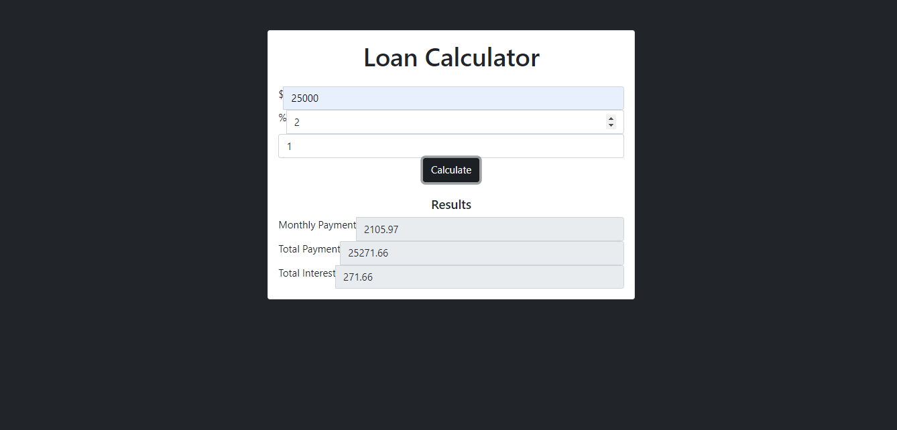

# Loan Calculator

The Loan Calculator is a web application designed to help users easily compute their monthly loan payments, total payment, and total interest based on the loan amount, interest rate, and loan term. This tool is beneficial for anyone looking to plan their loans or manage their finances effectively.

## Features

- User Input: Users can enter the loan amount, annual interest rate, and repayment period in years.
- Results Display: The app calculates and displays the monthly payment, total payment, and total interest.
- Clear and Intuitive UI: Simple and responsive design with a clean layout to easily navigate the input fields and results.
- Responsive Design: Works well across different devices, including mobile phones and desktops.

## Logic Behind the Loan Calculator

The loan calculator uses a common financial formula to calculate the monthly payment for a loan. Here’s a breakdown of how it works:

### Formula:

The monthly payment is calculated using the amortization formula:

\[
M = \frac{P \times r \times (1 + r)^n}{(1 + r)^n - 1}
\]

Where:
- M is the monthly payment.
- P is the principal loan amount.
- r is the monthly interest rate (the annual interest rate divided by 12).
- n is the total number of payments (the loan term in years multiplied by 12).

### Process:

1. Input Values:
   - Loan Amount: The total loan amount to be borrowed.
   - Interest Rate: The annual interest rate, entered as a percentage.
   - Repayment Period: The loan term in years.

2. Calculation:
   - The formula calculates the monthly payment, which is based on the amount borrowed, the interest rate, and the length of the loan.
   - Total Payment is derived by multiplying the monthly payment by the number of months.
   - Total Interest is obtained by subtracting the loan principal from the total payment.

## How to Use

1. Enter Loan Information:
   - Input the loan amount you wish to borrow (e.g., 25,000).
   - Input the annual interest rate (e.g., 2%).
   - Enter the loan term in years (e.g., 1 year).

2. Click "Calculate":
   - The calculator will instantly display the monthly payment, total payment, and total interest below the input fields.

3. Reset the Inputs:
   - You can reset the input fields and try other loan parameters as needed.

## Screenshot


Example of a loan calculation with $25,000 at 2% interest for 1 year.

## Installation

To run the Loan Calculator on your local machine, follow these steps:

1. Clone the repository:
   ```bash
   git clone https://github.com/JosAk01/loan_calculator.git
   ```

2. **Navigate to the project directory**:
   ```bash
   cd loan_calculator
   ```

3. Open the app:
   Simply open the `index.html` file in your preferred web browser to start using the calculator.

## Technologies Used

- HTML: For structuring the web interface.
- CSS: For styling the loan calculator interface.
- JavaScript: For implementing the loan calculation logic.
  
## Future Enhancements

- Currency Formatting: Add dynamic currency formatting for different regions.
- Validation: Add form validation to ensure valid inputs are entered.
- Graphical Representation: Display a graphical breakdown of the principal and interest over time.

## Contribution

Feel free to contribute to this project by:
1. Forking the repository.
2. Creating a new branch with your feature or bug fix.
3. Submitting a pull request for review.

